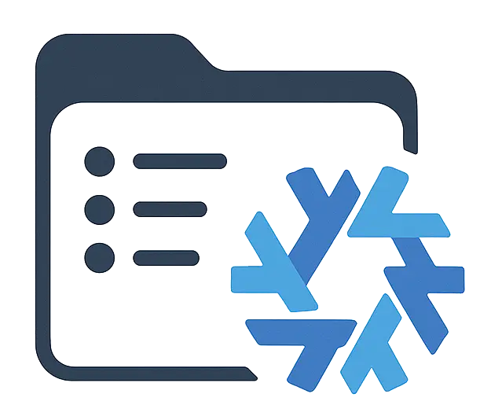

<a name="readme-top"></a>

<!-- PROJECT SHIELDS -->

[![Contributors][contributors-shield]][contributors-url]
[![Forks][forks-shield]][forks-url]
[![Stargazers][stars-shield]][stars-url]
[![Issues][issues-shield]][issues-url]
[![MIT License][license-shield]][license-url]
[![LinkedIn][linkedin-shield]][linkedin-url]

<!-- PROJECT LOGO -->
<br />
<div align="center">
  <a href="https://github.com/ThomasRitaine/nixos-config">
    
  </a>

<h3 align="center">NixOS Configuration</h3>

  <p align="center">
    A modular NixOS and Home Manager configuration for servers and personal laptop.
    <br />
    <a href="https://github.com/ThomasRitaine/nixos-config"><strong>Explore the docs »</strong></a>
    <br />
    <br />
    <a href="https://thomas.ritaine.com/projects">View Demo</a>
    ·
    <a href="https://github.com/ThomasRitaine/nixos-config/issues">Report Bug</a>
    ·
    <a href="https://github.com/ThomasRitaine/nixos-config/issues">Request Feature</a>
  </p>
</div>

<!-- TABLE OF CONTENTS -->
<details>
  <summary>Table of Contents</summary>
  <ol>
    <li><a href="#about-the-project">About The Project</a>
      <ul>
        <li><a href="#built-with">Built With</a></li>
      </ul>
    </li>
    <li><a href="#getting-started">Getting Started</a>
      <ul>
        <li><a href="#prerequisites">Prerequisites</a></li>
        <li><a href="#installation">Installation</a></li>
      </ul>
    </li>
    <li><a href="#usage">Usage</a>
      <ul>
        <li><a href="#applying-configurations">Applying Configurations</a></li>
        <li><a href="#updating-system">Updating System</a></li>
      </ul>
    </li>
    <li><a href="#repository-structure">Repository Structure</a></li>
    <li><a href="#key-modules">Key Modules</a></li>
    <li><a href="#hosts">Hosts</a></li>
    <li><a href="#roadmap">Roadmap</a></li>
    <li><a href="#contributing">Contributing</a></li>
    <li><a href="#license">License</a></li>
    <li><a href="#contact">Contact</a></li>
    <li><a href="#acknowledgments">Acknowledgments</a></li>
  </ol>
</details>

<!-- ABOUT THE PROJECT -->

## About The Project

[![NixOS Config Screenshot][product-screenshot]](https://thomas.ritaine.com)

This repository contains my NixOS configurations for multiple systems:

- **Declarative Config**: All settings in one place, versioned with Git
- **Multiple Systems**: Works on both servers and personal laptop
- **Modular Design**: Reusable components for shell, dev tools, and services
- **Nix Flakes**: For reproducible builds and easy deployment
- **Home Manager**: Consistent user environment across systems

This setup serves as both my personal configuration and a reference for others interested in NixOS.

<p align="right">(<a href="#readme-top">back to top</a>)</p>

### Built With

This configuration uses these technologies:

- [![NixOS][NixOS-shield]][NixOS-url]
- [![Home Manager][HomeManager-shield]][HomeManager-url]
- [![Zsh][Zsh-shield]][Zsh-url]
- [![Starship][Starship-shield]][Starship-url]
- [![Neovim][Neovim-shield]][Neovim-url]
- [![LazyVim][LazyVim-shield]][LazyVim-url]
- [![Docker][Docker-shield]][Docker-url]
- [![Kubernetes][K8s-shield]][K8s-url]
- [![Wezterm][Wezterm-shield]][Wezterm-url]
- [![Lazygit][Lazygit-shield]][Lazygit-url]
- [![Zoxide][Zoxide-shield]][Zoxide-url]

<p align="right">(<a href="#readme-top">back to top</a>)</p>

<!-- GETTING STARTED -->

## Getting Started

### Prerequisites

- **NixOS** or **Nix package manager** with flakes enabled
- **Git** for cloning the repository
- **Basic Nix knowledge** for customization

### Installation

1. **Clone the Repository**

   ```sh
   git clone https://github.com/ThomasRitaine/nixos-config.git
   cd nixos-config
   ```

2. **For NixOS Systems**

   ```sh
   sudo ln -sf $(pwd) /etc/nixos
   ```

3. **For Non-NixOS Systems** (Any OS that supports Home Manager)

   ```sh
   mkdir -p ~/.config/home-manager
   ln -sf $(pwd) ~/.config/home-manager/nixos-config
   ```

4. **Apply Configuration** following the usage section below

<p align="right">(<a href="#readme-top">back to top</a>)</p>

<!-- USAGE EXAMPLES -->

## Usage

### Applying Configurations

#### For NixOS Systems (VPS)

```sh
# Test configuration
sudo nixos-rebuild test --flake .#vps-8karm

# Apply configuration
sudo nixos-rebuild switch --flake .#vps-8karm
```

#### For Home Manager (Laptop)

```sh
# Apply Home Manager configuration
home-manager switch --flake .#laptop-ec
```

### Updating System

The repository includes a convenient update script:

```sh
# On NixOS systems
update         # Apply the configuration
update -t      # Test the configuration without applying

# On Home Manager systems
update         # Apply the Home Manager configuration
```

<p align="right">(<a href="#readme-top">back to top</a>)</p>

<!-- REPOSITORY STRUCTURE -->

## Repository Structure

```
.
├── .github/                  # GitHub-specific files
│   └── ISSUE_TEMPLATE/       # Templates for GitHub issues
├── docs/                     # Documentation assets
├── hosts/                    # Host-specific configurations
│   ├── laptop-ec/            # Configuration for Ubuntu with Home Manager
│   ├── vps-8karm/            # ARM-based VPS (primary)
│   └── vps-orarm/            # ARM-based VPS (secondary)
├── modules/                  # Reusable configuration modules
│   ├── home-manager/         # Home Manager modules
│   │   ├── lazygit/          # LazyGit terminal UI for Git
│   │   ├── neovim/           # Neovim editor configuration
│   │   │   ├── config/       # LazyVim config files, symlinked to ~/.config/nvim
│   │   │   ├── base.nix      # Basic Neovim setup without plugins
│   │   │   └── lazyvim.nix   # LazyVim distribution integration
│   │   ├── profiles/         # Common user profiles
│   │   ├── wezterm/          # Terminal emulator configuration
│   │   ├── dev-env.nix       # Development environment settings
│   │   ├── distro-icon.nix   # Linux distro detection icons
│   │   ├── fzf.nix           # Fuzzy finder configuration
│   │   ├── git-thomas.nix    # Personal Git configuration
│   │   ├── kubernetes.nix    # k8s tools configuration
│   │   ├── starship.nix      # Cross-shell prompt configuration
│   │   ├── update-flake.nix  # Helper script for updating
│   │   ├── utils.nix         # Common utilities package list
│   │   ├── zoxide.nix        # Smart directory navigation
│   │   └── zsh.nix           # Z-shell configuration and plugins
│   └── nixos/                # NixOS system modules
│       ├── vps/              # VPS-specific services
│       │   ├── applications-backup.nix   # Backup application dir
│       │   ├── fail2ban.nix  # Brute-force attack prevention
│       │   ├── firewall.nix  # Network security, port filtering
│       │   └── openssh.nix   # SSH server configuration
│       ├── common-vps.nix    # Shared VPS configurations
│       ├── docker.nix        # Docker container platform
│       └── zsh.nix           # System-wide Z-shell setup
├── secrets/                  # Contains hashed passwords on VPS
    └── .gitignore            # Prevents secrets from being committed
├── LICENSE                   # MIT license file
├── README.md                 # Repository documentation
├── flake.nix                 # Main entry point defining system configurations
└── flake.lock                # Lock file for reproducible builds
```

<p align="right">(<a href="#readme-top">back to top</a>)</p>

<!-- KEY MODULES -->

## Key Modules

### Development Tools

- **Neovim + LazyVim**: Code editor with IDE features out of the box
- **LazyGit**: Git terminal UI with conventional commits support
- **Docker**: Container platform for development and deployment
- **Kubernetes Tools**: kubectl, k9s, helm, and more for container orchestration

### System Services (VPS Only)

- **OpenSSH**: Remote access with key-based authentication
- **Fail2Ban**: Protection against brute force attempts
- **Firewall**: Basic network security
- **Backup**: Automated application backup

### Shell Environment

- **Zsh**: Shell with autocompletion and syntax highlighting
- **Starship**: Fast and customizable prompt showing context-aware info
- **Zoxide**: Smart `cd` command that remembers your most used directories
- **FZF**: Fuzzy finder for history, files, and more

![A demo of the shell][shell-usage-gif]

<p align="right">(<a href="#readme-top">back to top</a>)</p>

<!-- HOSTS -->

## Hosts

The repository manages multiple systems with different configurations:

| Host | Type | OS | Primary Use | Key Features |
|------|------|--------------|------------|--------------|
| **vps-8karm** | NixOS | NixOS | Service hosting | Docker, fail2ban, firewall, SSH, app backup |
| **vps-orarm** | NixOS | NixOS | Service hosting | Same as vps-8karm |
| **laptop-ec** | Home Manager | Ubuntu | Development | Full dev environment, GUI tools |

**Common Components**: All systems share user environment configuration including:

- Shell setup (Zsh, Starship)
- Development tools (Neovim, Git)
- Directory navigation (Zoxide, FZF)

The main difference is that the **VPS hosts** use complete NixOS system configurations including kernel, system services, and networking, while the **laptop** uses only Home Manager to configure the user environment on top of Ubuntu.

<p align="right">(<a href="#readme-top">back to top</a>)</p>

<!-- ROADMAP -->

## Roadmap

As a personal project, there's no formal roadmap. Some potential improvements:

- [ ] Secret management with agenix
- [ ] Container-based testing for configurations
- [ ] System monitoring and health checks

See [open issues](https://github.com/ThomasRitaine/nixos-config/issues) for more ideas.

<p align="right">(<a href="#readme-top">back to top</a>)</p>

<!-- CONTRIBUTING -->

## Contributing

While this is primarily a personal configuration, contributions are welcome.

<p align="right">(<a href="#readme-top">back to top</a>)</p>

<!-- LICENSE -->

## License

Distributed under the MIT License. See `LICENSE` for more information.

<p align="right">(<a href="#readme-top">back to top</a>)</p>

<!-- CONTACT -->

## Contact

Thomas Ritaine - <thomas@ritaine.com> - [LinkedIn](https://linkedin.com/in/thomas-ritaine)

Project Link: [https://github.com/ThomasRitaine/nixos-config](https://github.com/ThomasRitaine/nixos-config)

<p align="right">(<a href="#readme-top">back to top</a>)</p>

<!-- ACKNOWLEDGMENTS -->

## Acknowledgments

- [NixOS](https://nixos.org/) - The purely functional Linux distribution
- [Home Manager](https://github.com/nix-community/home-manager) - User environment management
- [Nix Flakes](https://nixos.wiki/wiki/Flakes) - Reproducible builds and dependencies
- [LazyVim](https://github.com/LazyVim/LazyVim) - Neovim distribution with sane defaults
- [Zsh](https://www.zsh.org/) - Extended shell with many improvements
- [Starship](https://starship.rs/) - Cross-shell prompt
- [Wezterm](https://wezfurlong.org/wezterm/) - Terminal emulator
- [Docker](https://www.docker.com/) - Container platform
- [Kubernetes](https://kubernetes.io/) - Container orchestration
- [Lazygit](https://github.com/jesseduffield/lazygit) - Terminal UI for Git
- [Zoxide](https://github.com/ajeetdsouza/zoxide) - Smarter cd command
- [FZF](https://github.com/junegunn/fzf) - Command-line fuzzy finder

<p align="right">(<a href="#readme-top">back to top</a>)</p>

<!-- MARKDOWN LINKS & IMAGES -->
<!-- https://www.markdownguide.org/basic-syntax/#reference-style-links -->

[contributors-shield]: https://img.shields.io/github/contributors/ThomasRitaine/nixos-config.svg?style=for-the-badge
[contributors-url]: https://github.com/ThomasRitaine/nixos-config/graphs/contributors
[forks-shield]: https://img.shields.io/github/forks/ThomasRitaine/nixos-config.svg?style=for-the-badge
[forks-url]: https://github.com/ThomasRitaine/nixos-config/network/members
[stars-shield]: https://img.shields.io/github/stars/ThomasRitaine/nixos-config.svg?style=for-the-badge
[stars-url]: https://github.com/ThomasRitaine/nixos-config/stargazers
[issues-shield]: https://img.shields.io/github/issues/ThomasRitaine/nixos-config.svg?style=for-the-badge
[issues-url]: https://github.com/ThomasRitaine/nixos-config/issues
[license-shield]: https://img.shields.io/github/license/ThomasRitaine/nixos-config.svg?style=for-the-badge
[license-url]: https://github.com/ThomasRitaine/nixos-config/blob/master/LICENSE
[linkedin-shield]: https://img.shields.io/badge/-LinkedIn-black.svg?style=for-the-badge&logo=linkedin&colorB=555
[linkedin-url]: https://linkedin.com/in/thomas-ritaine
[product-screenshot]: docs/images/screenshot.webp
[NixOS-shield]: https://img.shields.io/badge/NixOS-5277C3?style=for-the-badge&logo=nixos&logoColor=white
[NixOS-url]: https://nixos.org/
[HomeManager-shield]: https://img.shields.io/badge/Home_Manager-5277C3?style=for-the-badge&logo=nixos&logoColor=white
[HomeManager-url]: https://github.com/nix-community/home-manager
[Neovim-shield]: https://img.shields.io/badge/Neovim-57A143?style=for-the-badge&logo=neovim&logoColor=white
[Neovim-url]: https://neovim.io/
[LazyVim-shield]: https://img.shields.io/badge/LazyVim-8C61FF?style=for-the-badge&logo=neovim&logoColor=white
[LazyVim-url]: https://www.lazyvim.org/
[Zsh-shield]: https://img.shields.io/badge/Zsh-F15A24?style=for-the-badge&logo=zsh&logoColor=white
[Zsh-url]: https://www.zsh.org/
[Starship-shield]: https://img.shields.io/badge/Starship-DD0B78?style=for-the-badge&logo=starship&logoColor=white
[Starship-url]: https://starship.rs/
[Docker-shield]: https://img.shields.io/badge/Docker-2496ED?style=for-the-badge&logo=docker&logoColor=white
[Docker-url]: https://www.docker.com/
[K8s-shield]: https://img.shields.io/badge/Kubernetes-326CE5?style=for-the-badge&logo=kubernetes&logoColor=white
[K8s-url]: https://kubernetes.io/
[Wezterm-shield]: https://img.shields.io/badge/WezTerm-4E49EE?logo=wezterm&logoColor=fff&style=for-the-badge
[Wezterm-url]: https://wezfurlong.org/wezterm/
[Lazygit-shield]: https://img.shields.io/badge/Lazygit-F05032?style=for-the-badge&logo=git&logoColor=white
[Lazygit-url]: https://github.com/jesseduffield/lazygit
[Zoxide-shield]: https://img.shields.io/badge/Zoxide-777777?style=for-the-badge&logo=files&logoColor=white
[Zoxide-url]: https://github.com/ajeetdsouza/zoxide
[shell-usage-gif]: docs/images/shell-usage.gif
