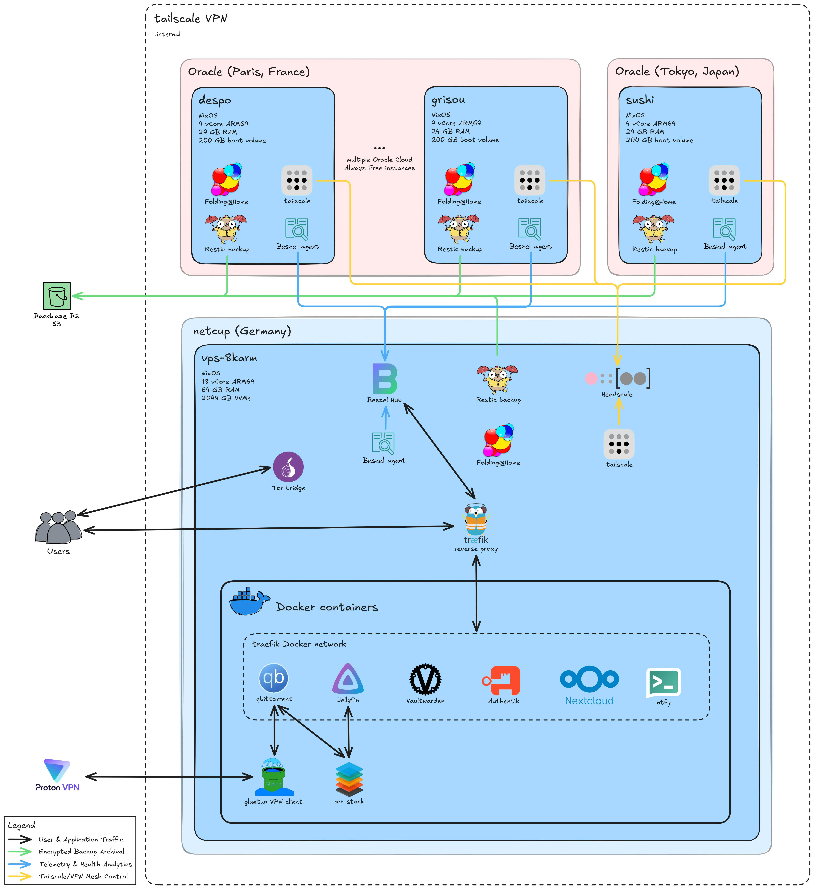

<a name="readme-top"></a>

<!-- PROJECT SHIELDS -->

[![Forks][forks-shield]][forks-url]
[![Stargazers][stars-shield]][stars-url]
[![Issues][issues-shield]][issues-url]
[![MIT License][license-shield]][license-url]
[![LinkedIn][linkedin-shield]][linkedin-url]

<!-- PROJECT LOGO -->
<br />
<div align="center">
  <a href="https://github.com/ThomasRitaine/nixos-config">
    
  </a>

<h3 align="center">NixOS Infrastructure & Dotfiles</h3>

  <p align="center">
    My personal configuration files for my NixOS global infrastructure and laptop.
    <br />
    <br />
    <a href="https://thomas.ritaine.com/projects">View Demo</a>
    ·
    <a href="https://github.com/ThomasRitaine/nixos-config/issues">Report Bug</a>
    ·
    <a href="https://github.com/ThomasRitaine/nixos-config/issues">Request Feature</a>
  </p>
</div>

<!-- TABLE OF CONTENTS -->
<details>
  <summary>Table of Contents</summary>
  <ol>
    <li><a href="#about-the-project">About The Project</a></li>
    <li><a href="#architecture">Architecture</a></li>
    <li><a href="#tree-structure">Tree Structure</a></li>
    <li><a href="#commands-to-know">Commands to Know</a>
      <ul>
        <li><a href="#remote-server-deployment">Remote Server Deployment</a></li>
        <li><a href="#local-laptop-deployment">Local Laptop Deployment</a></li>
        <li><a href="#secrets-management">Secrets Management</a></li>
      </ul>
    </li>
    <li><a href="#license">License</a></li>
  </ol>
</details>

## About The Project

> **Note:** This repository is mainly for me to document what I do. It contains hardcoded paths, personal public keys, and specific hardware configurations. Adapt it to your need before applying.

What started as a simple server has turned into a multi-node global fleet. I use this to self-host various apps (Jellyfin, Nextcloud, Vaultwarden), provide a Tor bridge, and donate idle CPU cycles to Folding@Home.

### Info

- **Management**: Flakes, Home Manager, Agenix for secrets
- **Networking**: Traefik reverse proxy, Tailscale mesh, Headscale controller
- **Backups**: Restic to Backblaze B2 (with pre-backup Docker SQL dumps)
- **Observability**: Beszel agent on every host and Beszel centralized Hub
- **Desktop / home-manager**: Hyprland, Kitty, Neovim with LazyVim, Fish shell

<p align="right">(<a href="#readme-top">back to top</a>)</p>

---

## Architecture



<p align="right">(<a href="#readme-top">back to top</a>)</p>

---

## Repository Structure

```text
.
├── .github/                  # GitHub-specific files
│   └── ISSUE_TEMPLATE/       # Templates for GitHub issues
├── docs/                     # Documentation assets and diagrams
├── hosts/                    # Host-specific configurations
│   ├── oracle-vps/           # Shared config for Oracle servers
│   ├── phoenix86/            # Laptop repurposed to a server at home
│   ├── vps-8karm/            # Primary server, ARM
│   └── winix/                # Personal laptop hardware/config
├── modules/                  # Reusable components
│   ├── home-manager/         # User dotfiles (neovim, hyprland, git, fish...)
│   └── nixos/                # System services for servers and laptop
├── secrets/                  # Agenix encrypted secrets and generation scripts
│   └── servers/              # Host-specific encrypted .age files
├── LICENSE                   # MIT license file
├── README.md                 # Repository documentation
├── flake.nix                 # Main entry point defining system configurations
├── flake.lock                # Lock file for reproducible builds
└── flake.nix                 # Entrypoint for all NixOS configurations
```

<p align="right">(<a href="#readme-top">back to top</a>)</p>

---

## Commands to Know

I use these commands constantly to deploy and manage the fleet.

### Remote Server Deployment

I push configurations from my local machine to the servers over SSH using NixOS rebuild.

**Deploy the main orchestrator (`vps-8karm`):**

```bash
nix run nixpkgs#nixos-rebuild -- switch \
  --flake .#vps-8karm \
  --target-host 8karm-thomas \
  --build-host 8karm-thomas \
  --sudo \
  --ask-sudo-password
```

**Deploy an edge node (e.g., `pharaoh`):**

```bash
nix run nixpkgs#nixos-rebuild -- switch \
  --flake .#pharaoh \
  --target-host pharaoh-thomas \
  --build-host pharaoh-thomas \
  --sudo \
  --ask-sudo-password
```

*(Alternatively, use the `deploy-server.sh` script to automate updating the fleet).*

### Local Laptop Deployment (`winix`)

To apply the configuration locally:

```bash
sudo nixos-rebuild switch --flake .#winix
```

### Secrets Management

When spinning up a **new host**, I use my custom Fish script to securely hash and encrypt the initial passwords via Agenix. First, source the script, then run it with the target hostname:

```bash
source secrets/create-host-secrets.fish
create-host-secrets koola
```

For **editing existing secrets** or adding specific files (like a Restic password for a specific host), I use the standard `agenix` command directly:

```bash
cd secrets && \
agenix -e servers/sushi/restic-password.age
```

<p align="right">(<a href="#readme-top">back to top</a>)</p>

---

## License

This code is registered under the MIT License. Do what you would like with it, and I hope this inspires you for your own configurations as many others have inspired me. Star if it helped !

<p align="right">(<a href="#readme-top">back to top</a>)</p>

[forks-shield]: https://img.shields.io/github/forks/ThomasRitaine/nixos-config.svg?style=for-the-badge
[forks-url]: https://github.com/ThomasRitaine/nixos-config/network/members
[stars-shield]: https://img.shields.io/github/stars/ThomasRitaine/nixos-config.svg?style=for-the-badge
[stars-url]: https://github.com/ThomasRitaine/nixos-config/stargazers
[issues-shield]: https://img.shields.io/github/issues/ThomasRitaine/nixos-config.svg?style=for-the-badge
[issues-url]: https://github.com/ThomasRitaine/nixos-config/issues
[license-shield]: https://img.shields.io/github/license/ThomasRitaine/nixos-config.svg?style=for-the-badge
[license-url]: https://github.com/ThomasRitaine/nixos-config/blob/master/LICENSE
[linkedin-shield]: https://img.shields.io/badge/-LinkedIn-black.svg?style=for-the-badge&logo=linkedin&colorB=555
[linkedin-url]: https://linkedin.com/in/thomas-ritaine
